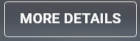
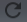
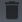
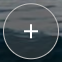
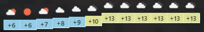

## 🌍 **Weather App (SPA showing weather in selected cities)**
### 🔗 Link to the page with the application https://fordreeg.github.io/
   ***
###📄 Application functionality
* city weather card
  #####
* when you click on the  button, a modal window with detailed information is displayed
  #####
* each city card has a  "refresh" button. When you press it, the weather of this city should be updated
  #####
* each city card has a  "delete" button. When pressed, the weather card is deleted
  #####
* there is an  "add" button at the end of the list. When adding
  a new city, a request is made to receive the current weather and display it on the screen.
  #####
* on the details page, the position of the block with the temperature is implemented, based on the magnitude of the value. For this, an additional request is made to obtain an hourly forecast for the current day. 

###
### ‍💻 API used: https://openweathermap.org/
###
### 🔧 Technologies that I use in development:
####

